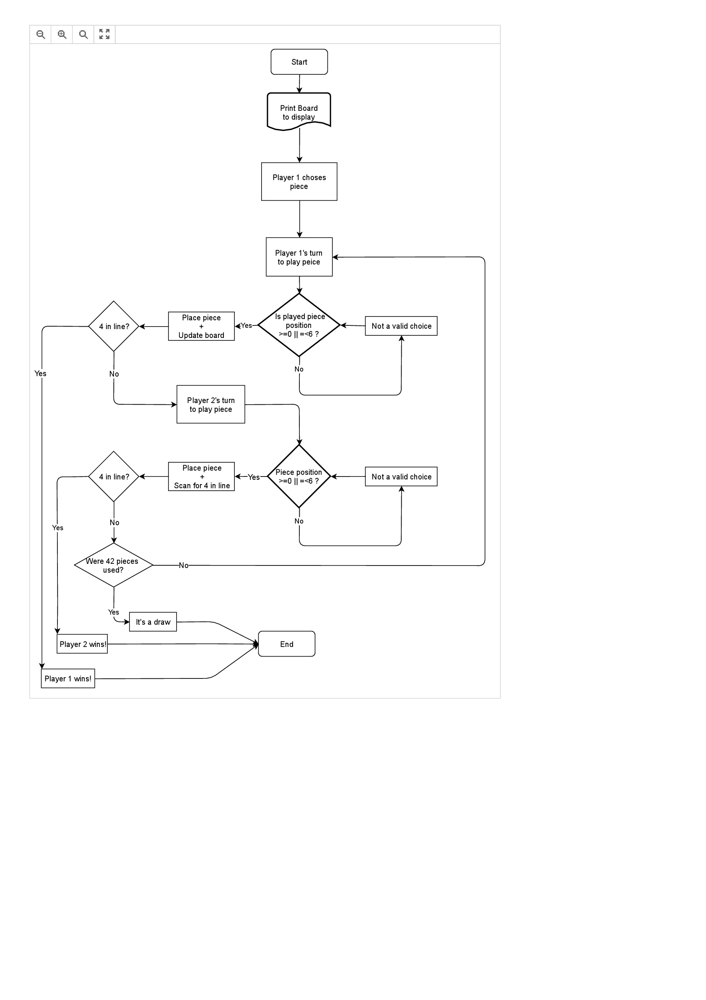

# quatro_em_linha
#jogo dedicado à cadeira de Linguagens de programação

Hugo Martins a21701372
Luís Laranjeira a21708058
Pedro Oliveira a21705187

Link para o repositório: https://github.com/psioliveira/quatro_em_linha

Neste projeto cada membro trabalhou os seguintes objetos :
(Os objetos em que se repetem na lista do que cada membro fez ou foi feito em conjunto)

Pedro: Block, Board, Player, Position, Program, Render, Shape e WinCheck;
Hugo: Block, Board, Position, Player, Program e WinCheck, README, UML;
Luís: Player;

O projeto "Quatro em Linha" tem o objetivo de emular o jogo em formato digital, sendo a base . Ao iniciar o jogo é apresentado o seguinte:
	-Um tabuleiro de 7x7
	-jogador
  -mensagem para o jogador informar peça e coluna

O objetivo dos jogadores é fazerem uma linha contínua de 4 peças de formas ou cores iguais,
sendo o 1º jogador com peças brancas ou cilindrícas e o 2º com peças vermelhas ou cúbicas.

O projeto foi organizado em que o objeto Program execute todos os objetos, sendo esses objetos Block, Board,
Player, Position, Render Shape e WinCheck.
 Ao iniciar o jogo o Render renderiza o Board e os Blocks em que o/s jogador/es colocarem com o tempo,
 enquanto jogam o WinCheck verifica se há quatro em linha, dividindo e scaneando o tabuleiro em grupos de 4,
 verificando na horizontal, vertical e diagonal, deslocando-se uma unidade para o lado se não for detetado nenhuma linha de quatro.
  Se já foram jogadas todas as 42 peças e não for detetado quatro em linha, o jogo automaticamente assume que é um empate,
 caso contrário e houver quatro em linha o jogo declara vitória de quem fez o quatro em linha.

## Aprendizagem

Com este projeto aprendemos a usar os Objetos e Classes de um modo mais simples
 comparado anteriormente a fazer este projeto, também aprendemos a usar as funcionalidades
 do GitHub com uma maior naturalidade.

Referências e notas: Este projeto foi feito com a base do projeto "Jogo do galo" em que o próprio professor sugeriu para usar como base.

(No ficheiro .zip está incluído o Fluxograma e o UML do projeto).

## fluxograma

## Diagrama UML

![] (4 Em Linha UML-001.jpg)
